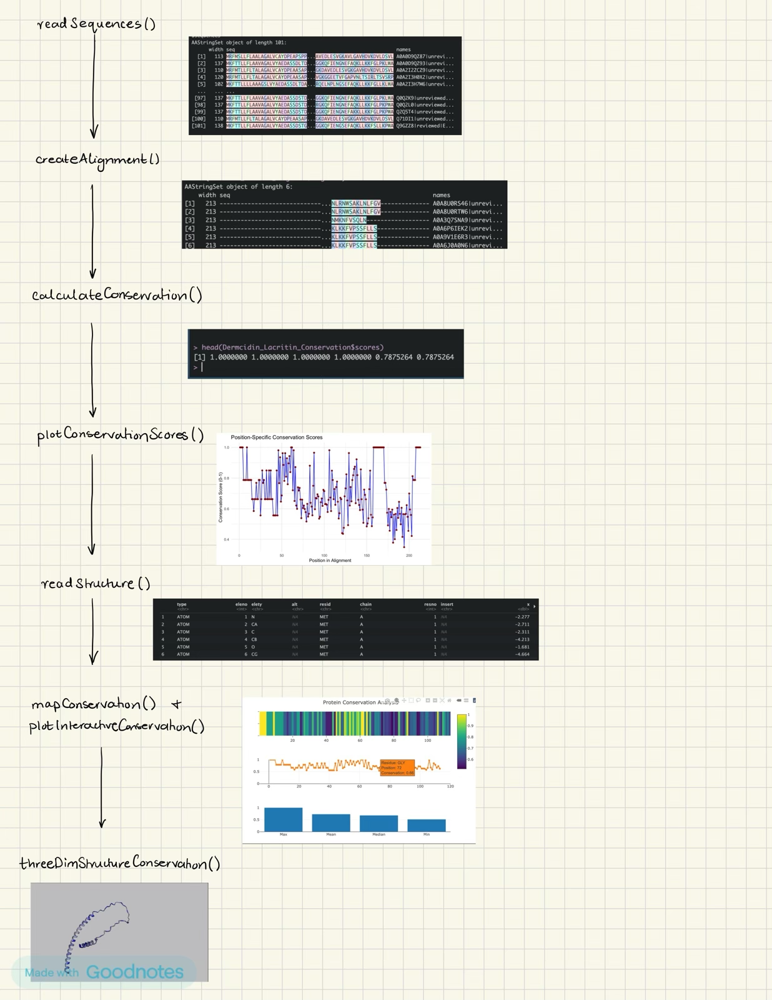

<!-- README.md is generated from README.Rmd. Please edit that file -->

# ProtConservR

R package for Analyzing and Visualizing Protein Sequence Conservation.
<!-- badges: start --> <!-- badges: end -->

## Description

`ProtConservR` is an R package for analyzing and visualizing protein
sequence conservation. It provides functions to (1) Read and process
protein sequences from FASTA files, (2) Create multiple sequence
alignments from these protein sequence multifasta files using MUSCLE or
ClustalW. (3) Calculate position-specific conservation scores based on
shannon entropy. (4) Map sequence conservation scores to protein
structure data. (5) Create plots and interactive visualizations of
conservation data, including line plots of conservation scores across
residues, heatmaps of conservation scores on protein structure data
(residues), and 3D visualizations of protein structure colored by
conservation.

Session Info: 
R version 4.3.1 (2023-06-16)
Platform: aarch64-apple-darwin20 (64-bit)
Running under: macOS Sonoma 14.6.1

## Installation

You can install the latest version of ProtConservR like so:

``` r
install.packages("devtools")
library("devtools")
devtools::install_github("dhanyajagan/ProtConservR", build_vignettes = TRUE)
library("ProtConservR")
```

To run the Shiny app: `runProtConservR()`

## Overview

The instructions below are for taking a look at the vignettes for this
package:

``` r
ls("package:ProtConservR")
data(package = "ProtConservR") 
browseVignettes("ProtConservR")
```

`ProtConservR` contains 8 functions.

1.  ***readSequences*** Reads in unaligned protein sequences provided in
    a multifasta file. Protein sequences should be of a particular
    protein family, like hemoglobin, insulin,etc. User can use sample
    data located in inst/extdata/, or they can pull multifasta files of
    protein families of their choice from InterPro website as input into
    this function.

2.  ***createAlignment*** Performs multiple sequence alignment on
    protein sequences using either MUSCLE or ClustalW algorithm with
    default settings. Takes processed sequences from readSequences()
    function as input.

3.  ***calculateConservation*** This function calculates conservation
    scores for each position in a multiple sequence alignment using
    Shannon’s entropy. The scores are then normalized to a 0-1 scale
    where 1 indicates perfect conservation.

4.  ***plotConservationScores*** This function creates a plot of
    conservation scores for each position in a multiple sequence
    alignment (plotting sequence conservation scores).

5.  ***readStructure*** This function reads and processes a protein
    structure from a specified PDB file. Users must provide a file path
    to a PDB file.

6.  ***mapConservation*** This function maps sequence conservation
    scores onto protein structure by aligning the structural residues
    with the corresponding positions in the multiple sequence alignment.
    It handles potential gaps and mismatches between the structure and
    alignment in a very simple way.

7.  ***plotInteractiveConservation*** Creates an interactive
    visualization of protein conservation scores using plotly. This
    function takes as input the output of mapConservation() and
    generates multiple visualization types including a heatmap view of
    the conservation scores, a line plot showing conservation across
    residues, and summary statistics.

8.  ***threeDimStructureConservation*** Creates an interactive 3D
    visualization of the pdb protein structure colored by conservation
    scores. Takes as input the representative pdb file and output from
    mapConservation and uses r3dmol to create an interactive viewer
    where conservation scores are mapped to a color gradient from red
    (low conservation) to white (medium) to blue (high conservation).

Refer to package vignettes for more details. An overview of the package
is illustrated below. 

## Contributions

The author of the package is Dhanya Jagannathan. The author wrote the
following 8 functions: *readsequences*, *readStructure*,
*createAlignment*, *calculateConservation*, *mapConservation*,
*plotConservationScores*, *plotInteractiveConservation*, and
*threeDimStructureConservation*. The *readsequences* function makes use
of the `Biostrings` package to read in fasta file input, and takes
inspiration from the `bio3D` package’s `read.fasta()` function. The
*createAlignment* function makes use of the `Biostrings`, `msa`, and
`muscle` packages, and takes inspiration from the `bio3D` package’s
`read.fasta()` function. The *calculateConservation* function makes use
of `Biostrings` package, and takes inspiration from the `bio3D`
package’s `conserv()` and `consensus()` functions. It also takes
inspiration from the fact that shannon entropy was used in `bio3D`
package as well. However, this packages implementation to calculate
conservation scores utilized the Biostrings consensusmatrix, which is
what makes it different. The *plotConservationScores* function makes
heavy use of `ggplot2` package for plotting of the conservation scores
from alignment. The *readStructure* function to read in pdb protein
files utilizes the `read.pdb()` function from the `bio3D` package. The
*mapConservation* function utilizes the `bio3D` package functions
`atom.select` and `pdbseq` in order to map the conservation scores from
protein sequence alignment to the pdb structure/residues. The
*plotInteractiveConservation* function makes interactive plots of the
output of mapConservation, and utilizes the `plotly`, `stats`, and
`magrittr` packages. Lastly, the function
*threeDimStructureConservation* utilizes the `r3dmol` and `grDevices`
packages to create an interactive 3D protein visualization of sequence
conservation overlayed onto protein structure. ChatGPT was used across
the functions, to develop the roxygen tags for the functions, and was
also used to debug errors caused by incorrectly written functions. Other
than this, generative AI was NOT used for core code/ideas/problem
solving.

## References

- Nicholas Rego and David Koes, 3Dmol.js: molecular visualization with
  WebGL,, Volume 31, Issue 8, April 2015, Pages 1322–1324, .

- Sievert C (2020). Interactive Web-Based Data Visualization with R,
  plotly, and shiny. Chapman and Hall/CRC. ISBN 9781138331457,
  <https://plotly-r.com>.

- Barry J. Grant, Ana P. C. Rodrigues, Karim M. ElSawy, J. Andrew
  McCammon, Leo S. D. Caves, Bio3d: an R package for the comparative
  analysis of protein structures, , Volume 22, Issue 21, November 2006,
  Pages 2695–2696, .

- Wickham H (2016). Springer-Verlag New York. ISBN 978-3-319-24277-4,
  <https://ggplot2.tidyverse.org>.

- Valdar, W.S.J. (2002). Scoring residue conservation. , 48(2), 227-241.

- Strait BJ, Dewey TG. The Shannon information entropy of protein
  sequences. Biophys J. 1996 Jul;71(1):148-55. doi:
  10.1016/S0006-3495(96)79210-X. PMID: 8804598; PMCID: PMC1233466.

- Pagès H, Aboyoun P, Gentleman R, DebRoy S (2024). R package version
  2.74.0, .

- Edgar, R.C. (2004) MUSCLE: multiple sequence alignment with high
  accuracy and high throughput. 32(5):1792-1797.

- Thompson, J.D., Higgins, D.G., Gibson, T.J. (1994) CLUSTAL W:
  improving the sensitivity of progressive multiple sequence alignment
  through sequence weighting, position-specific gap penalties and weight
  matrix choice. 22(22):4673-4680.

- Bodenhofer U, Bonatesta E, Horejs-Kainrath C, Hochreiter S (2015).
  “msa: an R package for multiple sequence alignment.” , 31(24),
  3997–3999. <doi:10.1093/bioinformatics/btv494>

- OpenAI. (2024). ChatGPT (November 5, 2024). Retrieved from
  <https://chat.openai.com>

## Acknowledgements

This package was developed as part of an assessment for 2024 BCB410H:
Applied Bioinformatics course at the University of Toronto, Toronto,
CANADA. `ProtConservR` welcomes issues, enhancement requests, and other
contributions. To submit an issue, use the[GitHub
issues](https://github.com/dhanyajagan/ProtConservR/issues)
